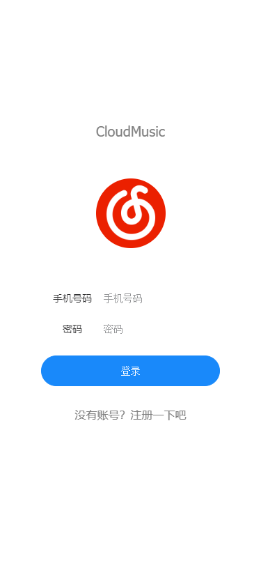
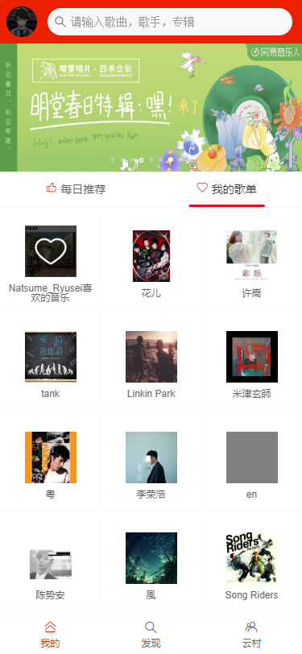

# Cloudmusic-Vue
## beta v0.0.1(This work is still under development)
<p align="center"><a href="https://vuejs.org" target="_blank" rel="noopener noreferrer"></a>
<a href="https://github.com/Binaryify/NeteaseCloudMusicApi" target="_blank" rel="noopener noreferrer"></a>
</p>
<p align="center">
    
</p>
<h2>Interface Screenshots</h2>
<p align="center">



</p>


## Project setup
```
npm install
```

### Compiles and hot-reloads for development
```
npm run serve
```

### Compiles and minifies for production
```
npm run build
```

### Lints and fixes files
```
npm run lint
```

### Customize configuration
See [Configuration Reference](https://cli.vuejs.org/config/).
